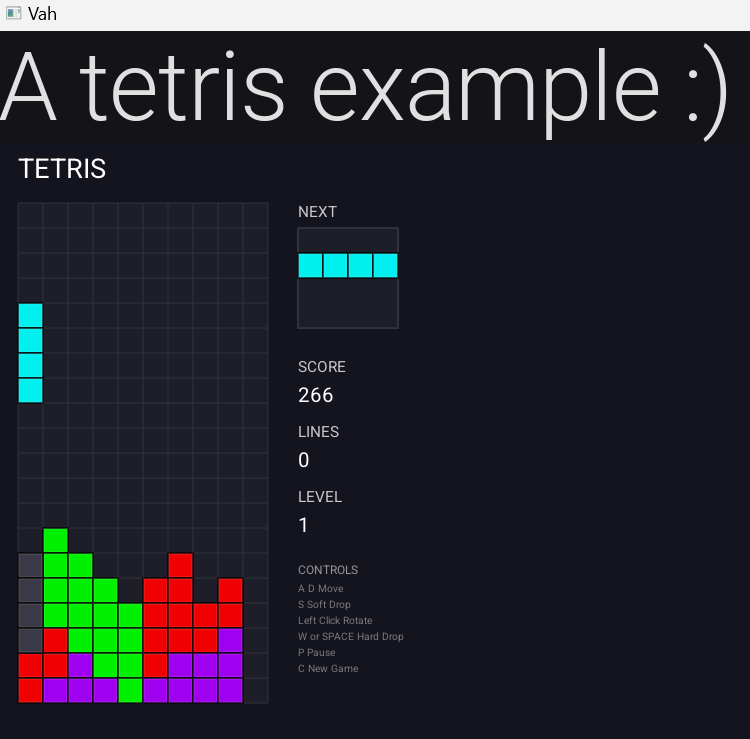
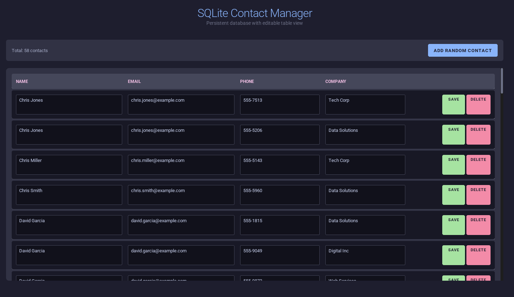
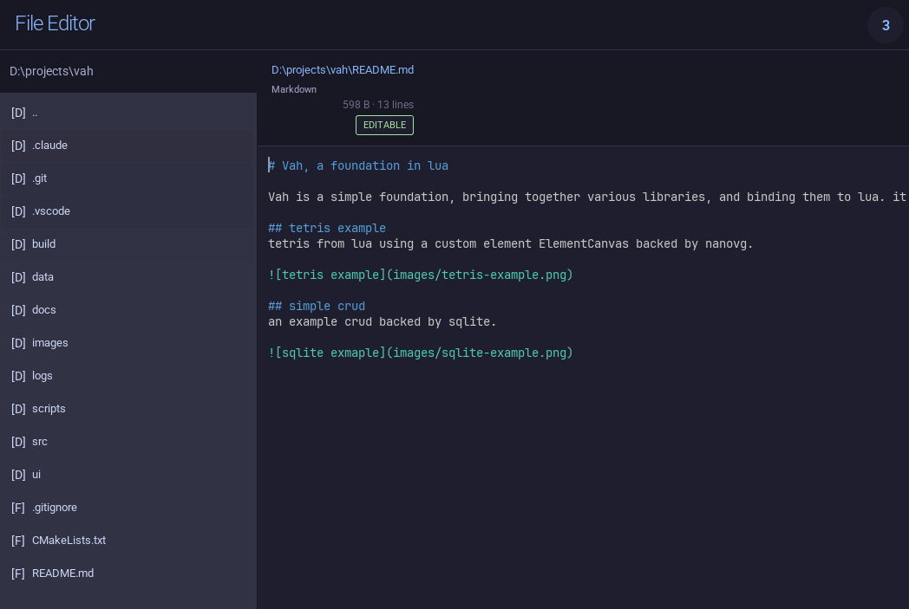

# Vah, a foundation in lua

Vah is a simple foundation, bringing together various libraries, and binding them to lua. it uses HTML/CSS (subset of css3, css2) type language in rml and rcss for the view. it uses lua in isolated threads for workers. it has a data binding system allowing sqlite backed data to be easily rendered, edited, saved, or deleted. 

## tetris example
tetris using a custom element ElementCanvas backed by nanovg.

## simple crud
an example crud backed by sqlite.

## file editor
an example file editor using a custom element ElementTextEditor for content changes. 

